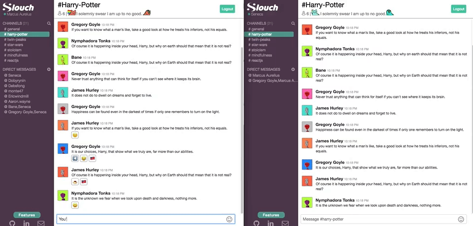
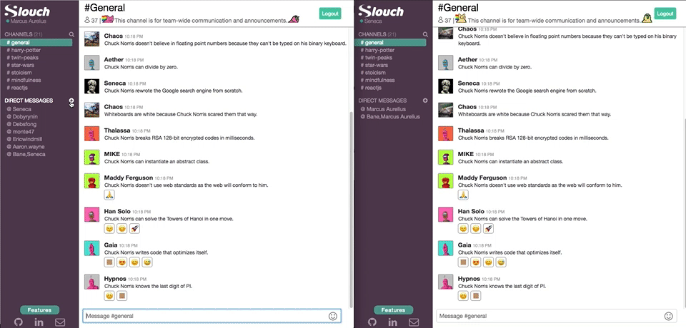
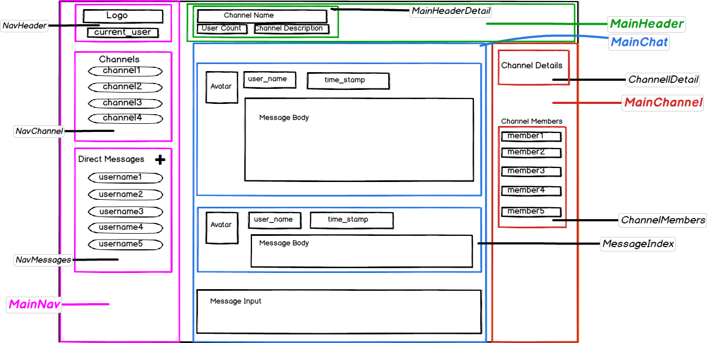

Slouch is a messaging web application inspired by Slack built using Ruby on Rails on the backend. For the frontend, the application leverages React and Redux architecture to create responsive UX and decreased server requests by building a single page web application. It also utilizes a PostgresSQL database, BCrypt for authentication, and integrates Rails Action Jobs to serve as a backend queue enabling asynchronous broadcast of new messages.

Live Site: [Slouch-App](www.slouch-app.com)

## Table of Contents
1. [Technology](#technology)
2. [Features](#features)
    - [Authentication](#authentication)
    - [Live Chat](#live-chat)
    - [Direct Message/Channel Searching](#channels)
    - [Emojis](#emojis)
3. [Design](#design)
    - [Wireframe](#wireframe)
    - [Schema](#Schema)
4. [Future Release](#future-release)

## Technology

Slouch utilizes the following:

- Ruby on Rails / PostgreSQL
- React.js / Redux
- jQuery / BCrypt
- Emoji-mart / React-emoji
- Ajax / npm 

## Features

### Authentication

Slouch uses the **BCrypt** gem for authentication, which hashes a password and stores the digest into the database. `Session tokens` are saved and compared to cookies to identify the user's current session. `Routes` were set up to redirect users that were not logged in back to the home page.

```javascript
const App = () => (
  <div>
    <Switch>
      <Route path ='/form' component={ChannelFormContainer}/>
      <ProtectedRoute path='/main' component={MainApp}/>
      <AuthRoute path='/' component={HomeIndexContainer}/>
    </Switch>
      <Route exact path ='/' component={HomeWelcome}/>
      <AuthRoute path='/login' component={SessionFormContainer}/>
      <AuthRoute path='/signup' component={SessionFormContainer}/>
  </div>
);
```

### Live Chat

Slouch utilizes **Rails 5.0 Action Cables** to maintain a Websocket TCP connection allowing users to communicate in real time and receive notifications. As a user enters a chatroom, they will be automatically `subscribed` to the channel. After a message is created, our Action Cables will `broadcast` the message to every user currently subscribed to the chatroom channel. Once the message is received, **React** will update it's `store` and send new `props` to the chatroom component resulting in a re-render.



```javascript
setupSubscription() {
  App.messages = App.cable.subscriptions.create('MessagesChannel', {
    channel_id: this.props.currentChannel.id,
    connected: function () {
      this.perform("follow",
      { channel_id: this.channel_id });
    },
    received: function(data) {
      this.updateMessages(data);
    },
  }
```

Users are also `subscribed` to a user channel containing their user ID to allow private notifications to be sent when a new direct message channel is open.



```javascript
setupSubscription() {
  App.messages = App.cable.subscriptions.create('UsersChannel', {
    user_id: this.props.currentUser.id,
    connected: function () {
      this.perform("follow",
      { user_id: this.user_id });
    },
    received: function(data) {
      this.updateUser(data);
    }
  }
```

Once a message is received on the Rails backend and committed to the PostgresSQL database, our `Message` Model will relay a message to our `MessageRelayJob`. This will broadcast a JSON object to all the clients subscribed to the channel.


```ruby
class Message < ApplicationRecord
  after_commit { MessageRelayJob.perform_later(self)}
end
```

```ruby
class MessageRelayJob < ApplicationJob
  def perform(message)
    ActionCable.server.broadcast("channels:#{message.channel_id}:messages",
      id: message.id,
      body: message.body,
      username: message.user.username,
      avatar: message.user.image_url,
      time_stamp: message.updated_at
      )
  end
end
```

### Direct Message/Channel Searching

Users can create new direct messages to another user or multiple users. They can create a new direct message by clicking on the user they want to talk to on the member details sidebar or using the plus symbol on the nav bar.


Public channels implement their own search form to prevent the creation of public channels.


```javascript
class FindChannel extends React.Component {
  constructor(props) {
    super(props);
    this.state = {
      channel_name: "",
      public_channels: []
    };
    this.updateHandler = this.updateHandler.bind(this);
    this.submitHandler = this.submitHandler.bind(this);
    this.mapChannels = this.mapChannels.bind(this);
  }
```

### Emojis

Slouch uses the `EmojiMart` node module for its emoji library. Users can add add emojis to their input text or add them to the messages as reactions.


```javascript
import { Picker } from 'emoji-mart';

emojiList() {
  return (
    <div tabIndex="0" ref="emojilist" className="emoji-wrapper"
      onBlur={this.hideEmojis}>
        <Picker set='emojione'
          className="emoji-mart"
           style={this.state.emoji_css}
           onClick={this.addEmoji}/>
    </div>
  );
}

```

When an icon is picked from our emojiList, a request is sent through `addEmoji` action which will trigger a AJAX request to `POST` a new reaction.
After a json response is received back, an `Action` will be dispatch to our `Reducers` which updates the particular slice of state within the store.

## Design

### Wireframe



Each color of wireframe represents a React container, while each box represents a different React component. This wireframe was created before any code for this project was written. For more wireframes, please see the /doc/wireframes directory.

## Schema Information
### users
column name     | data type | details
----------------|-----------|-----------------------
id              | integer   | not null, primary key
username        | string    | not null, indexed, unique
password_digest | string    | not null
session_token   | string    | not null, indexed, unique
image_url       | string    | not null
### messages
column name | data type | details
------------|-----------|-----------------------
id          | integer   | not null, primary key
body        | text      | not null
channel_id  | string    | not null, foreign key
user_id     | integer   | not null, foreign key
### channels
column name | data type | details
------------|-----------|-----------------------
id          | integer   | not null
name        | string    | not null, indexed, unique
description | string    | not null
private     | boolean   | not null, default: false
### subscription
column name | data type | details
------------|-----------|-----------------------
id          | integer   | not null, primary key
user_id     | integer   | not null, foreign key
channel_id  | integer   | not null, foreign key
### reaction
column name | data type | details
------------|-----------|-----------------------
id          | integer   | not null, primary key
emoji       | string    | not null
channel_id  | string    | not null, foreign key
user_id     | integer   | not null, foreign key

## Future Release
#### Notifications
Add notifications to the channel navigation bar to bold white when a new message is received from a non-current subscribed channel.
#### Admin Channel access
Create an admin class in that will allow admins to create and edit channels.
#### Messages - delete and edit
Allow users to delete and edit their own messages.
#### User profile
Allow users to set up a profile and edit the image of their avatar.
